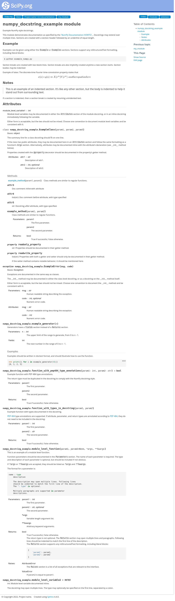

# Sphinx scipy documentation sphinx

## Step by step

1. Copy `docs` folder in your repository (in the folder containing everything related to the documentation)
2. `docs/source/conf.py` is the configuration file (project name, project version, module location, etc...). In this file, **replace variable values** where there is a **FIXME**. Other variables values can be modified to customize the documentation generation (no explanation will be given here).
3. Build the docker image: `docker build -t mysphinx-latexpdf -f docs/Dockerfile`. That docker image contains all the required dependencies for sphinx.
4. Create reStructuredText module configuration using the built image: `docker run --rm -v /home/li0nmo0se/project/sphinx_scipy_doc/:/docs mysphinx-latexpdf sphinx-apidoc -f -o ./docs/source  my_module/`. The reStructuredText files describe the python module files and `sphinx-apidoc` will create them automatically.

### Generate documentation locally

5. Genertate the html documentation: `docker run --rm -v  /home/li0nmo0se/project/sphinx_scipy_doc/:/docs mysphinx-latexpdf /bin/sh -c "cd docs && make clean && make html"`
6. **(Linux only)** Change file permission to yourself: `sudo chown -R $(whoami) docs/`. Docker created those files as root and it is not convenient.
7. View documentation: open `docs/build/html/index.html`

### Generate documentation on readthedocs.io

1. Log in/Sign up on [https://readthedocs.org/](https://readthedocs.org/)
2. Link your github account: `settings` > `Connected Services` > `Connect to GitHub` (or Gitlab)
3. Create readthedocs project: `My Projects` > `Import a Project`  > (refresh if nothing showing) > Select repository > In Project Details, fill `default branch` with `master` or `main` and click next.
4. Build the documentation: `My Projects` > select your project > `Build version` > wait until the build is finished. You can look at the logs to check whether everything works fine
5. View the documentation: When the building is finished, visit the repository documentation website. `My Projects` > select your project > `View your documentation`.

## MISC

* In order to change the logo, you may replace `/docs/source/_theme/scipy/static/img/scipy_org_logo.png` by your own logo. Keep the same filename!

## References

* [Sphinx usage overview](https://shunsvineyard.info/2019/09/19/use-sphinx-for-python-documentation/)
* [Scipy sphinx theme](https://github.com/scipy/scipy-sphinx-theme)
* [Docker sphinx](https://github.com/plaindocs/docker-sphinx)
* [readthedocs tutorial (readthedocs setup)](https://sphinx-rtd-tutorial.readthedocs.io/en/latest/read-the-docs.html)
* [readthedocs tutorial with sphinx (sphinx setup)](https://samnicholls.net/2016/06/15/how-to-sphinx-readthedocs/)

## Output generated documentation

The generated documentation will be exactly the same regardless it was built locally or on the cloud with readthedocs.

### readthedocs

This was generated by following all the steps from `Step by step` section with readthedoc build.
* [https://sphinx-scipy-doc.readthedocs.io/en/latest/?](https://sphinx-scipy-doc.readthedocs.io/en/latest/?)
### Locally

This was generated by following all the steps from `Step by step` section with local build.

